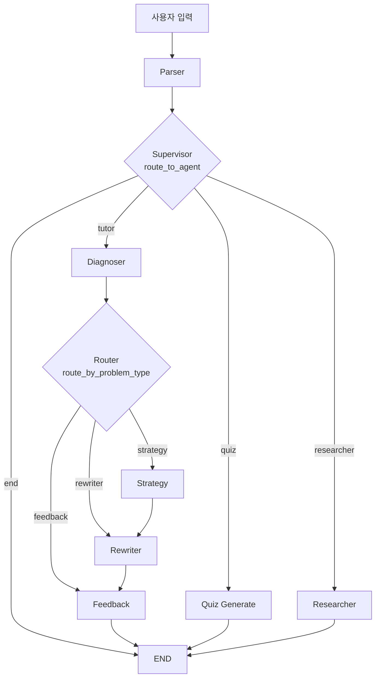
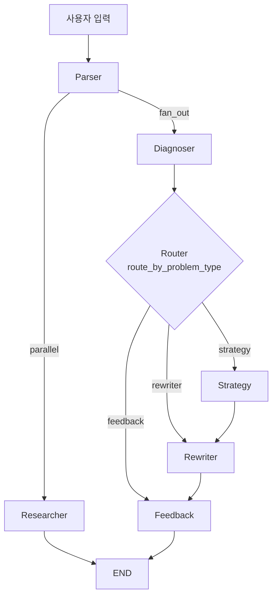

# 좋은 질문 연습실 (Question Lab)

AI 기반 질문 코칭 에이전트입니다. 사용자의 질문을 진단하고, 개선 전략을 제안하며, 더 좋은 질문으로 리라이팅해줍니다.

**배포 링크:** https://question-lab.streamlit.app

## 사용 방법

1. 앱에 접속하면 채팅 입력창이 나타납니다
2. 사이드바에서 원하는 모드를 선택합니다 (코칭 / 퀴즈 / 사례 검색)
3. 채팅창에 질문을 입력하면 입력한 질문이 말풍선으로 표시되고, AI가 분석을 시작합니다
4. **코칭 모드:** 진단 결과(점수, 문제 유형, 개선 전략, 리라이팅)가 표시되면 [수락] [수정] [재시도] 중 선택
5. **퀴즈 모드:** 나쁜 질문 예시가 출제되면 문제점을 답변으로 입력
6. **사례 검색 모드:** 주제를 입력하면 좋은 질문 사례와 프레임워크를 추천

## 주요 기능

| 모드 | 설명 |
|------|------|
| **코칭** | 질문을 입력하면 진단(10점 만점) → 개선 전략 → 리라이팅 제안 |
| **퀴즈** | 나쁜 질문 예시의 문제점을 맞추는 퀴즈 |
| **사례 검색** | 주제별 좋은 질문 사례와 프레임워크 추천 |

## 기술 스택

- **LLM:** OpenAI GPT
- **Orchestration:** LangGraph
- **Frontend:** Streamlit
- **Language:** Python 3.11+

## 프로젝트 구조

```
question-lab/
├── streamlit_app.py          # Streamlit 웹 UI
├── main.py                   # CLI 진입점
├── app/
│   ├── graph.py              # LangGraph 워크플로우 정의
│   ├── llm.py                # LLM 클라이언트 설정
│   ├── nodes/                # 그래프 노드 (parser, diagnoser, router, strategy, rewriter, feedback, export)
│   ├── agents/               # 에이전트 (quiz, researcher, supervisor, tutor)
│   └── prompts/              # 프롬프트 템플릿
├── tests/                    # 테스트
├── requirements.txt
└── runtime.txt
```

## 설치 및 실행

```bash
# 의존성 설치
python -m venv .venv
source .venv/bin/activate
pip install -r requirements.txt

# 환경 변수 설정
cp .env.example .env
# .env 파일에 OPENAI_API_KEY 입력

# Streamlit 실행
streamlit run streamlit_app.py

# CLI 실행
python main.py
```

## 배포

Streamlit Community Cloud에 배포되어 있습니다: https://question-lab.streamlit.app

- Repository: `Lucy1315/question-lab-ai-agent-master`
- Main file: `streamlit_app.py`
- Secrets에 `OPENAI_API_KEY` 설정 필요

## LangGraph Node Flow

### 메인 그래프 (Supervisor 라우팅)



### 병렬 코칭 그래프 (Fan-out / Fan-in)



### 노드 설명

| 노드 | 역할 |
|------|------|
| **Parser** | 사용자 질문을 분석하고 모드별로 라우팅할 상태 준비 |
| **Supervisor** | 모드(coach/quiz/research)에 따라 적절한 에이전트로 분기 |
| **Diagnoser** | 질문 품질을 진단하고 10점 만점으로 점수 산출 |
| **Router** | 문제 유형에 따라 Strategy/Rewriter/Feedback으로 분기 |
| **Strategy** | 질문 개선 전략 수립 |
| **Rewriter** | 진단과 전략을 바탕으로 질문 리라이팅 |
| **Feedback** | 전체 과정을 종합한 피드백 생성 |
| **Researcher** | 주제 관련 좋은 질문 사례와 프레임워크 검색 |
| **Quiz Generate** | 나쁜 질문 예시와 퀴즈 출제 |
| **Quiz Evaluate** | 사용자의 퀴즈 답변 평가 |
